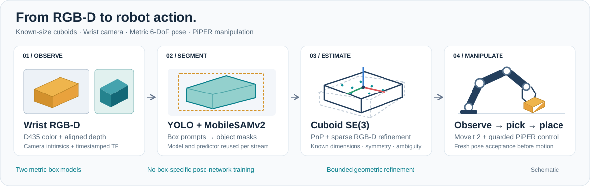
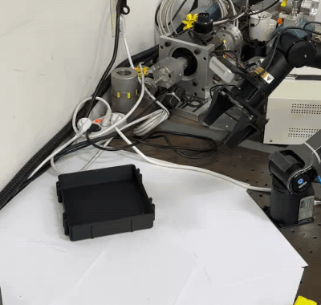
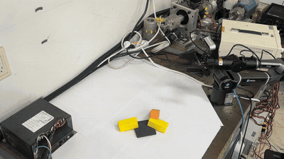
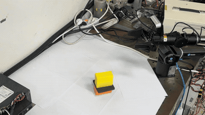
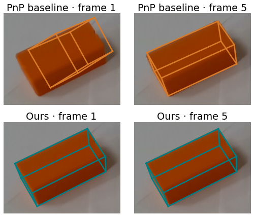

# PiPER Manipulation

**RGB-D cuboid pose estimation and manipulation with a wrist-mounted camera.**

[](https://github.com/HYUNSEOKKKKKK/Piper_manipulation/actions/workflows/ci.yml)
[](docs/INSTALL.md)
[](docs/INSTALL.md)
[](DOC.md)
[](NOTICE.md)

[**Demos**](#demos) · [**Installation**](#installation) · [**Usage**](#usage) · [**Documentation**](DOC.md) · [**한국어**](docs/README.ko.md)



### Key features

- **Known dimensions → metric pose.** Estimate object-centred `R, t` from RGB-D and masks, without printed markers or box-specific pose-network training.
- **Incomplete silhouettes and multiple sizes.** Combine PnP/depth hypotheses, sparse refinement and exact cuboid symmetries; reject ambiguous poses and model identities.
- **Bounded perception cost.** Share geometry observations across models, refine at most four candidates, and reuse the detector backend. An optional C++ residual accelerates the NumPy implementation.
- **From perception to a real arm.** Timestamped pose acceptance, MoveIt 2 planning, gripper control and guarded PiPER commands. `feed-auto` starts repeated transfers with one `c` approval.

## Demos

<table>
  <tr>
    <td align="center" colspan="2">
      <b>Continuous <code>feed-auto</code> run</b><br>
      Four transfers from a single approval · 4× playback<br><br>
      
    </td>
  </tr>
  <tr>
    <td align="center" width="50%">
      <b>Separated boxes</b><br>
      One recorded pick-and-place cycle · 4× playback<br><br>
      
    </td>
    <td align="center" width="50%">
      <b>Stacked boxes</b><br>
      First recorded pick from the stack · 4× playback<br><br>
      
    </td>
  </tr>
</table>

The top clip is one continuous `feed-auto` run: a single approval, then four boxes
transferred as they are fed onto the table one at a time. The two clips below show the
**earlier nine-stage feed controller**, with operator approval for each cycle. All three
are recorded physical transfers; none of them shows autonomous clearing of an arbitrary pile.
[Clip intervals and provenance](assets/README.md).

<details>
<summary><b>View a real-camera cuboid pose example</b></summary>

<p align="center">
  
</p>

Two archived views of the same stationary box: a PnP baseline (top) and RGB-D
refinement (bottom). These overlays illustrate repeatability; they do not provide
external ground-truth pose accuracy. [Method details](docs/METHOD.md).

</details>

## News & updates

- **2026-09-20:** A recorded continuous `feed-auto` run was added to the demos.
- **2026-09-17:** Public release with two box models, continuous `feed-auto`, pinned dependencies, verified model downloads, a CPU example and automated tests. Recorded demos and a visual pipeline are now included.

## Supported hardware and inputs

| Component | Supported setup | Notes |
|---|---|---|
| Robot | AgileX PiPER with parallel gripper | MoveIt 2 + AgileX ROS driver / SDK over CAN |
| Wrist camera | Intel RealSense D435 | RGB, aligned depth, intrinsics and calibrated TF |
| Development platform | Ubuntu 22.04 · ROS 2 Humble · Python 3.10 | CUDA GPU for the documented live perception setup |
| Offline pose input | Object mask + metric depth + intrinsics | CPU-only example; no robot, ROS or weights needed |
| Box model A | **78 × 35 × 30 mm** | `box_78x35x30` |
| Box model B | **78 × 53 × 30 mm** | `box_78x53x30` |

Pose fitting does not assume a box lies flat on the table. Grasp reachability,
occlusion and pile clearance still limit physical manipulation. To add a size,
edit [`config/object_models.json`](config/object_models.json) and use the same
catalog in perception and control. See [model configuration](docs/ROBOT.md#configure-the-actual-setup).

## Installation

### Try perception first — CPU only

```bash
git clone https://github.com/HYUNSEOKKKKKK/Piper_manipulation.git
cd Piper_manipulation
python3.10 -m venv .venv-core
source .venv-core/bin/activate
python -m pip install -r requirements-core.txt
bash scripts/build_native.sh
python examples/estimate_pose.py
```

The example renders a tilted cuboid and writes `outputs/example/pose.json` and
`overlay.png`. Its errors use **synthetic ground truth**. The native build is
optional; skip it to use the NumPy fallback.

### Install the complete robot system

Follow **[the full installation guide](docs/INSTALL.md)** for ROS packages, separate
robot/perception environments, CUDA and the colcon build. The source and model
preparation commands are:

```bash
python3 scripts/fetch_dependencies.py
python3 scripts/fetch_weights.py
```

Vendor sources and URDF submodules are pinned to specific revisions. The three
checkpoints total about **188 MiB** and are downloaded separately, with size and
SHA-256 verification. Raw videos, checkpoints, vendor checkouts and build outputs
stay outside Git; only the small README previews are included.
[Model sources and download alternatives](weights/README.md).

## Usage

### 1. Estimate a pose from your own RGB-D data

```bash
python examples/estimate_pose.py --npz /path/to/frame.npz
```

| NPZ field | Shape | Convention |
|---|---|---|
| `mask` | H × W | Mask for one object |
| `depth_m` | H × W | Aligned optical-axis depth, in metres |
| `K` | 3 × 3 | Intrinsics for that image |
| `dims_m` | 3 | Box side lengths, in metres |

The result is the **box-centre pose in the camera optical frame**:
`p_camera = R @ p_object + t`. The controller's face-based grasp frame is a
separate adaptation. [Algorithm and frame conventions](docs/METHOD.md).

### 2. Run PiPER — three terminals

Complete installation and adapt the camera mount, TCP and workspace to your
hardware first. Follow **[Robot operation](docs/ROBOT.md)**, then run these commands
from the repository root:

```bash
# Terminal 1 — robot driver, MoveIt, camera and controller
bash scripts/run_robot.sh feed-auto
```

```bash
# Terminal 2 — perception with the same model catalog and workspace
bash scripts/run_bridge.sh feed-auto
```

```bash
# Terminal 3 — start / stop console
bash scripts/run_console.sh
```

Press **`c` once, without Enter**, after clearing the motion area. The current
`feed-auto` sequence observes, picks, retreats, moves directly to the fixed drop
point, opens the gripper and returns to camera-ready. It skips home between boxes.

| Mode | Use |
|---|---|
| `grasp` | Step approval with the real gripper |
| `feed` | One original feed cycle per `c`, with precise placement slots |
| `feed-auto` | One `c` for repeated picking and a fixed air-drop destination |
| `preview` | Hardware-connected planning preview; use the CPU example for a hardware-free test |

The example drop TCP is **(410, −180, 150) mm** in `base_link`, with up to 10
transfers. Clearance checks may stop sooner. Enter/Space request stop; `h` → `y`
is the confirmed home/reset sequence. Perception waiting can resume automatically,
so stop before adding boxes. [Console controls and recovery](docs/ROBOT.md#console).

## Performance and validation

| Measurement | Result | Scope |
|---|---|---|
| Recorded live processing rate | **7.7 Hz median**; 6.3–10.3 Hz, 5th–95th percentile | RTX 2070 SUPER + i9-9900K; 274 overlapping windows in a historical two-model run |
| CPU regression suite | **125 passed**, 1 ROS-only test skipped | Geometry, configurations and release tools |
| Mocked ROS/perception suite | **393 passed** | Controller decisions, pose adaptation, recovery and command gates |
| Independent ROS build | **6 packages built** | Vendor interfaces, description, driver and `piper_pnp` |

Processing Hz differs from camera FPS, accepted-target rate and robot cycle time.
The timing topic `/cuboid_pose_bridge/performance` reports stage costs; no
from-scratch OS installation or new physical trial is claimed by these checks.
[Measurement scope](docs/METHOD.md#timing-and-evidence) · [Validation record](docs/VALIDATION.md).

<details>
<summary><b>Repository layout</b></summary>

```text
Piper_manipulation/
├── assets/           # Lightweight README figures and recorded demo previews
├── perception/       # Cuboid geometry, timing, native residual and ROS bridge
├── ros2/piper_pnp/   # FSM, MoveIt, guarded control, launch, URDF and RViz
├── config/           # Model catalog and example workspaces
├── scripts/          # Fetch, build, run, validate and export demo previews
├── examples/         # CPU pose example and external RGB-D input
├── tests/            # Perception and release tests; ROS tests live in the package
├── third_party/      # Source pins, weight hashes, deployment patches and notices
└── docs/             # Installation, operation, method and validation
```

Start with the [documentation index](DOC.md) for the relevant source entry points.

</details>

## Acknowledgements

Built on [MobileSAM / MobileSAMv2](https://github.com/ChaoningZhang/MobileSAM),
[Ultralytics](https://github.com/ultralytics/ultralytics),
[MoveIt 2](https://github.com/moveit/moveit2),
[AgileX ROS](https://github.com/agilexrobotics/agx_arm_ros),
[pyAgxArm](https://github.com/agilexrobotics/pyAgxArm),
[ros2_aruco](https://github.com/JMU-ROBOTICS-VIVA/ros2_aruco) and
[yejunjoo/piper_pnp](https://github.com/yejunjoo/piper_pnp).
README organization was inspired by [GMR](https://github.com/YanjieZe/GMR).

## Citation and license

```bibtex
@software{piper_manipulation_2026,
  author = {{Piper_manipulation contributors}},
  title = {Piper Manipulation: RGB-D Cuboid Pose Estimation and Manipulation},
  year = {2026},
  url = {https://github.com/HYUNSEOKKKKKK/Piper_manipulation}
}
```

Please also acknowledge the upstream methods. Machine-readable citation:
[`CITATION.cff`](CITATION.cff).
Original project code is **Apache-2.0**; the derived ROS package is **BSD-3-Clause**.
The combined inference environment includes **AGPL-3.0 Ultralytics** components,
and the AgileX SDK is **LGPL-3.0-only**. See **[NOTICE.md](NOTICE.md)** for exact
attribution and component terms. These links cite software, not a conference publication.
