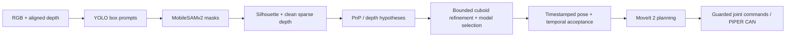

# Piper_manipulation

RGB-D cuboid pose estimation and pick-and-place with an AgileX PiPER arm and
an eye-in-hand Intel RealSense D435. Known box dimensions replace printed markers
or object-specific pose-network training.

[한국어 안내](docs/README.ko.md) · [Installation](docs/INSTALL.md) ·
[Robot operation](docs/ROBOT.md) · [Method and performance](docs/METHOD.md) ·
[Licenses and upstream credits](NOTICE.md)



The geometric estimator supports incomplete silhouette polygons, multiple known
box sizes, arbitrary object orientations and exact cuboid symmetries. Ambiguous
or unreliable estimates are rejected. There is no flat-on-table prior in pose
fitting; grasp planning and collision geometry still have workspace constraints.

The current `feed-auto` mode moves visible source-region boxes sequentially to
one drop point after one `c` approval. It retains the tested feed picking path,
omits home between boxes, moves directly from pick retreat to the drop point,
opens the gripper without a placement descent, and returns to camera-ready for
the next observation. See [the operational limits](docs/ROBOT.md).

## Try pose estimation without a robot or GPU

```bash
git clone https://github.com/HYUNSEOKKKKKK/Piper_manipulation.git
cd Piper_manipulation
python3.10 -m venv .venv-core
source .venv-core/bin/activate
python -m pip install -r requirements-core.txt
bash scripts/build_native.sh
python examples/estimate_pose.py
python -m pytest -q
```

The example independently renders a tilted cuboid and writes `outputs/example/pose.json`
and `overlay.png`. The reported error uses synthetic ground truth; it is not a
real-camera accuracy measurement. Omit the C++ build to use the slower NumPy
fallback. For your own aligned data:

```bash
python examples/estimate_pose.py --npz /path/to/frame.npz
```

The NPZ contains `mask` (H×W), `depth_m` (H×W, optical-axis depth in metres), `K`
(3×3 intrinsics for the same image), and `dims_m` (three metric box dimensions).
The output maps object-centred coordinates into the camera optical frame:
`p_camera = R @ p_object + t`. See [METHOD.md](docs/METHOD.md).

## Full system

Supported development target: Ubuntu 22.04, ROS 2 Humble, Python 3.10, CUDA-capable
NVIDIA GPU. Follow [INSTALL.md](docs/INSTALL.md) to fetch pinned dependencies,
verify model weights and build the separate ROS workspace.

After adapting the camera mount, TCP and workspace to your hardware, open three
terminals **at the repository root**:

```bash
# Terminal 1: MoveIt, camera, guarded robot driver and controller
bash scripts/run_robot.sh feed-auto

# Terminal 2: perception with the SAME workspace configuration
bash scripts/run_bridge.sh feed-auto

# Terminal 3: start/stop console; press c without Enter after clearing the workspace
bash scripts/run_console.sh
```

These are physical-robot commands. Read [ROBOT.md](docs/ROBOT.md) first. The
`preview` wrapper still connects to hardware; use the CPU example above for a
hardware-independent start. The low-level firmware controller is supplied by
AgileX; this project plans trajectories and guards the command forwarding.

## Repository layout

| Directory | Contents |
|---|---|
| `perception/` | RGB-D pose solver, native residual source, timing, ROS bridge |
| `ros2/piper_pnp/` | FSM, MoveIt interface, command gate, recovery, launch/URDF/RViz |
| `config/` | Two box models and example feed/drop workspaces, in metres |
| `scripts/` | Dependency/weight downloads, build, launch and validation helpers |
| `examples/` | Hardware-free pose example and external RGB-D input format |
| `tests/` and `ros2/piper_pnp/test/` | Geometry and mocked integration regressions |
| `third_party/` | Exact source pins, checksums, small deployment patches and credits |

The two default boxes are **78 × 35 × 30 mm** and **78 × 53 × 30 mm**. The example
continuous-feed destination is **(410, −180, 150) mm** in `base_link`, with a
maximum of 10 transfers. These are example settings from the development setup,
not a calibration for another robot.

## Downloads and reproducibility

Model weights (about 188 MiB), vendor checkouts, videos, logs, environments and
compiled outputs are excluded from Git. Run `scripts/fetch_dependencies.py` and
`scripts/fetch_weights.py`; the latter verifies file size and SHA-256 before use.
The MobileSAMv2 detector alone is larger than GitHub's 100 MiB regular-file limit.
See [GitHub's large-file documentation](https://docs.github.com/en/repositories/working-with-files/managing-large-files/about-large-files-on-github).
Original weights stay with their publishers; they are not re-hosted here.

A recorded two-model deployment on an RTX 2070 SUPER / i9-9900K had a median
**7.7 Hz** processing rate across 274 overlapping timing windows (5th–95th
percentile: 6.3–10.3 Hz). This is historical end-to-end processing throughput,
not a fresh benchmark of every checkout, per-object FPS, or robot cycle speed.
See [measurement scope and limitations](docs/METHOD.md).

## License and citation

Original project code uses Apache-2.0. The derived ROS package uses BSD-3-Clause;
MobileSAMv2's bundled Ultralytics code includes **AGPL-3.0** components, and the
AgileX SDK uses LGPL-3.0-only. These licenses retain their own conditions. See
[NOTICE.md](NOTICE.md) before redistributing the combined system. Please cite the
software using [CITATION.cff](CITATION.cff) and acknowledge the upstream methods.
This repository does not claim acceptance at any conference.
